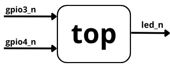

# AND

Ejemplo de compuerta AND usando dos entradas con pull-up y un LED activo en bajo.


## Qué Aprendes

- Invertir entradas activas en bajo.
- Construir lógica combinacional.
- Mapear el resultado a un LED activo en bajo.

## Archivos

- `and/devlab.toml`
- `and/devlab-vhdl.toml`
- `and/src/top.v`
- `and/src/top.vhd`
- `and/pins.cst`

## Lógica

Las entradas físicas se invierten dentro del HDL para que el valor lógico sea `1` cuando el botón está presionado. El LED se enciende cuando ambas entradas lógicas valen `1`.



## Código Fuente

::: code-group

```verilog [Verilog]
module top (
    input wire gpio3_n,
    input wire gpio4_n,
    output wire led_n
);
    wire a = ~gpio3_n;
    wire b = ~gpio4_n;

    assign led_n = ~(a & b);
endmodule
```

```vhdl [VHDL]
library ieee;
use ieee.std_logic_1164.all;

entity top is
    port (
        gpio3_n : in std_logic;
        gpio4_n : in std_logic;
        led_n : out std_logic
    );
end entity top;

architecture rtl of top is
    signal a : std_logic;
    signal b : std_logic;
begin
    a <= not gpio3_n;
    b <= not gpio4_n;

    led_n <= not (a and b);
end architecture rtl;
```

:::

## Compilar

```bash
cd and
devlab build
devlab flash
```

## VHDL

```bash
cd and
devlab build -c devlab-vhdl.toml
devlab flash
```
