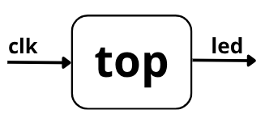

# Blink

Ejemplo mínimo para comprobar reloj, síntesis, place-and-route y carga en una FPGA Gowin.

## Qué aprenderás

- Usar `clk` como reloj de sistema.
- Implementar un contador.
- Observar un bit del contador en el LED.
- Compilar y cargar con DevLab.

## Archivos

- `blink/devlab.toml`: build Verilog.
- `blink/devlab-vhdl.toml`: build VHDL.
- `blink/src/top.v`: implementación Verilog.
- `blink/src/top.vhd`: implementación VHDL.
- `blink/pins.cst`: pines de la placa.

## Lectura del Circuito

El contador incrementa en cada flanco de subida de `clk`. Un bit alto del contador cambia lento y se conecta al LED para producir parpadeo visible.



## Pinout

| Señal | Función | Pin FPGA | IO_TYPE |
| --- | --- | --- | --- |
| `clk` | Reloj de sistema | 52 | `LVCMOS33` |
| `led` | LED de salida | 16 | `LVCMOS33` |

```text [pins.cst]
IO_LOC "clk" 52;
IO_PORT "clk" IO_TYPE=LVCMOS33;

IO_LOC "led" 16;
IO_PORT "led" IO_TYPE=LVCMOS33;
```

## Código Fuente

::: code-group

```verilog [Verilog]
module top (
    input wire clk,
    output reg led
);
    reg [23:0] counter = 0;

    always @(posedge clk) begin
        counter <= counter + 1;
        led <= counter[23];
    end
endmodule
```

```vhdl [VHDL]
library ieee;
use ieee.std_logic_1164.all;
use ieee.numeric_std.all;

entity top is
    port (
        clk : in std_logic;
        led : out std_logic
    );
end entity top;

architecture rtl of top is
    signal counter : unsigned(23 downto 0) := (others => '0');
begin
    process (clk)
    begin
        if rising_edge(clk) then
            counter <= counter + 1;
            led <= counter(23);
        end if;
    end process;
end architecture rtl;
```

:::

## Compilar

```bash
cd blink
devlab build
devlab flash
```

## VHDL

```bash
cd blink
devlab build -c devlab-vhdl.toml
devlab flash
```
