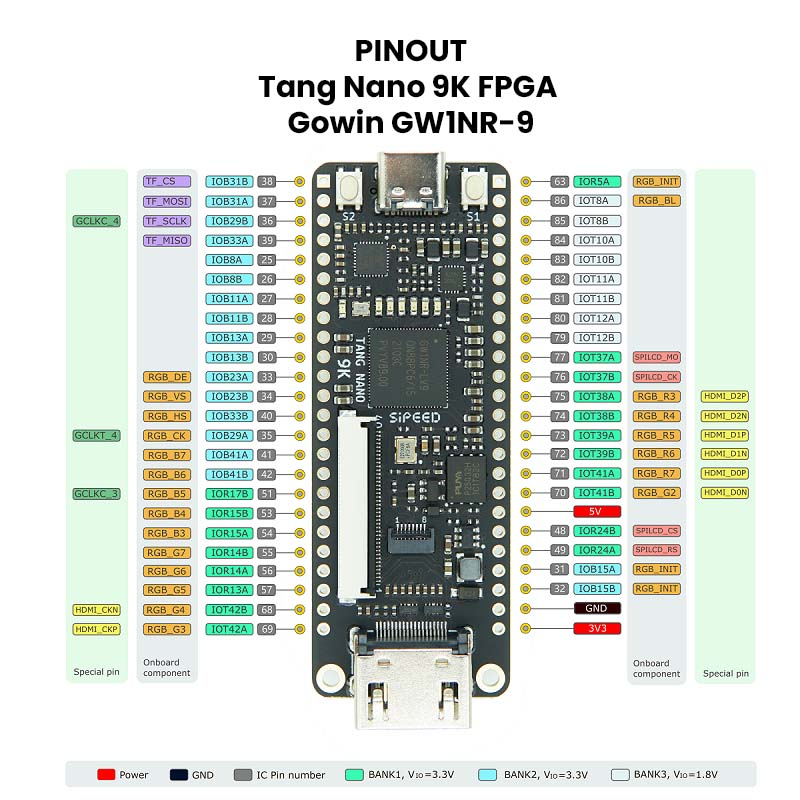

# Digital Labs

Las prácticas de `digital-labs` cubren bloques combinacionales, contadores y máquinas de estado. Todas siguen la misma estructura:

```text
digital-labs/<practica>/
|-- devlab.toml
|-- devlab-vhdl.toml
|-- pins.cst
|-- src/
|   |-- digital_labs.v
|   |-- top.v
|   `-- top.vhd
`-- README.md
```

Estas páginas funcionan como el material de laboratorio de la [ruta del curso](../../guide/curso.md). Cada práctica incluye objetivo, entradas y salidas, comandos de compilación, conceptos clave, actividades y un entregable sugerido.

## Pinout de la Tarjeta

Usa esta referencia para revisar la ubicación física de `clk`, botones, LEDs y conectores antes de modificar `pins.cst`.



## Antes de Empezar

- Verifica que `devlab doctor` no reporte errores críticos.
- Revisa si tu tarjeta usa los mismos pines que `pins.cst`.
- Recuerda que `led_n` es activo en bajo: el LED enciende con `0`.
- En los botones con sufijo `_n`, el valor lógico se invierte dentro del `top`.

## Prácticas Combinacionales

- [01 Sumador N bits](./01_sumador_n_bits.md)
- [02 Restador N bits](./02_restador_n_bits.md)
- [03 Comparador N bits](./03_comparador_n_bits.md)
- [04 Decodificador 7 segmentos](./04_decodificador_7_segmentos.md)
- [05 Decodificador 16 segmentos](./05_decodificador_16_segmentos.md)
- [06 Restador a 7 segmentos](./06_restador_a_7_segmentos.md)
- [07 ALU N bits](./07_alu_n_bits.md)

## Prácticas Secuenciales

- [08 Señal de reloj](./08_senal_reloj.md)
- [09 Contador ascendente](./09_contador_ascendente.md)
- [10 Contador descendente](./10_contador_descendente.md)
- [11 Contador ascendente-descendente](./11_contador_ascendente_descendente.md)
- [12 Contador con arranque, paro y reset](./12_contador_arranque_paro_reset.md)
- [13 Máquina Moore](./13_maquina_moore.md)
- [14 Máquina Mealy](./14_maquina_mealy.md)

## Prácticas de Señal

- [15 DAC R-2R de 8 bits](./15_dac_r2r_8_bits.md)
- [16 DAC R-2R con contador de modo](./16_dac_r2r_contador.md)

## Comandos Base

```bash
cd digital-labs/01_sumador_n_bits
devlab build
devlab flash
```

Para VHDL:

```bash
devlab build -c devlab-vhdl.toml
```

## Entrega Base

Para cada práctica entrega una nota breve con:

- Tabla de verdad o tabla de estados.
- Captura o transcripción del comando `devlab build`.
- Descripción de lo observado en el LED.
- Respuesta a las preguntas de cierre.
