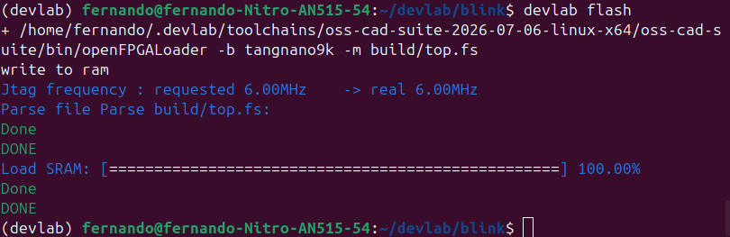
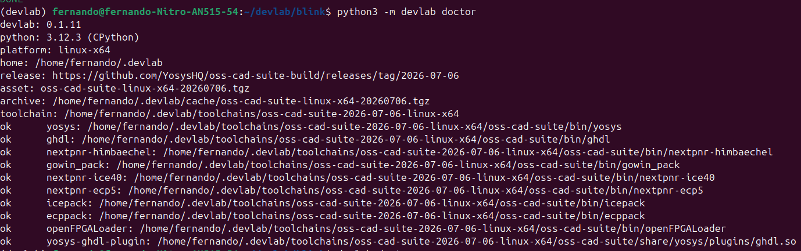

# Guía Rápida para Linux 

Esta guía proporciona pasos específicos para configurar DevLab en Linux desde la distribución de Ubuntu.

## Instalación Rápida

### 1. Instalar Requisitos

```bash
# Verificar que Python 3.11+ esté instalado
python3 --version
```

### 2. Ambiente virtual


```bash
# Crear entorno virtual de nombre devlab-fpga
python3 -m venv devlab-fpga

# Activar el entorno virtual
source devlab-fpga/bin/activate

# Desactivar el entorno virtual
deactivate
```

### 3. Instalar DevLab

```bash
# Actualizar pip
pip install --upgrade pip

# Instalar DevLab
pip install devlab-fpga

# Verificar instalación
devlab --version
devlab doctor
devlab install
```

## Permisos de escritura

Para que se carguen los archivos a la **Tang Nano 9k**, se deben otorgar permisos de escritura. Deberás conectar tu dispositivo a la computadora para continuar.

```bash
# Listar todos los dispositivos conectados
lsusb
```
El siguiente comando es para crear una regla `udev`

```bash
sudo nano /etc/udev/rules.d/99-ft2232.rules
```
Agrega la siguiente regla:

```bash
SUBSYSTEM=="usb", ATTR{idVendor}=="0403", ATTR{idProduct}=="6010", MODE="0666"
```
Guarda con: 

`Ctrl + O`

`Enter`

`Ctrl + X`

Esta regla permite acceso de lectura/escritura al dispositivo USB para todos los usuarios.

### Recargar reglas `udev`
Después de guardar el archivo, ejecuta:

```bash
sudo udevadm control --reload-rules
sudo udevadm trigger
```

Desconecta y vuelve a conectar el dispositivo.

## Inicializar un proyecto


```bash
# Crear proyecto de nombre blink
devlab new blink --hdl vhdl

# Entrar a la carpeta del proyecto
cd blink

# Abrir el proyecto en Visual Studio Code
code . 
```

### Opcional

Si quires ejecutar el código por defecto, debes agregar las siguientes líneas de código en el archivo `pins.cst`: 

```cst
IO_LOC "clk" 52;
IO_LOC "led" 10;
```

Más adelante se profundizará en la sintaxis del archivo `pins.cst`

## Uso Diario

### Compilar un Proyecto

Estos son los comandos que usarás cada que quieras cargar programas a tu **Tang Nano**

```bash
# Compilar con Verilog
devlab build

# Compilar con VHDL
devlab build -c devlab-vhdl.toml

# Cargar en la FPGA
devlab flash
```



*Resultado exitoso de `devlab flash` cargando el bitstream en la FPGA*

### Comandos Útiles

```bash
# Ver información del sistema
python3 -m devlab doctor
```



*Comando `devlab doctor` mostrando las herramientas instaladas*

```bash
# Ver ayuda
python3 -m devlab --help
```

## Recursos Adicionales

- [Guía General de DevLab](./devlab.md)
- [Archivos CST](./cst.md)
- [Introducción a Verilog](./verilog.md)
- [Introducción a VHDL](./vhdl.md)