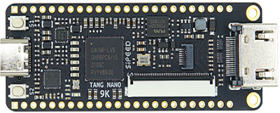
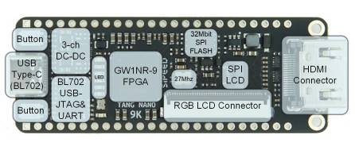

# Tang Nano 9K

## Información

La **Tang Nano 9K** es una placa de desarrollo de [Sipeed](https://uelectronics.com/sipeed/) basada en el FPGA **Gowin GW1NR-9**. Permite diseñar, sintetizar, simular y probar circuitos digitales escritos en Verilog o VHDL. Combina la flexibilidad de un FPGA con un formato compacto, bajo consumo y costo accesible.

La placa incorpora un chip **BL702** que proporciona las interfaces USB-JTAG y USB-UART para el GW1NR-9. Un solo cable USB-C permite alimentar la tarjeta, programar el FPGA y utilizar la comunicación serie.

La Tang Nano 9K no incluye un procesador RISC-V físico. Sin embargo, su capacidad lógica permite implementar *softcores* RISC-V completos, como PicoRV, además de diseños lógicos convencionales.

## Distribución de la placa

El siguiente diagrama ayuda a identificar los principales componentes y conectores antes de comenzar una práctica.

- **USB Type-C / BL702:** alimentación, programación USB-JTAG y comunicación USB-UART.
- **GW1NR-9:** FPGA principal donde se implementa el circuito.
- **Oscilador de 27 MHz:** reloj disponible para los diseños.
- **SPI Flash de 32 Mbit:** almacenamiento no volátil externo.
- **Conectores HDMI, RGB y SPI LCD:** interfaces para proyectos de video y pantallas.
- **Botones:** dos entradas programables para el usuario.

## Especificaciones y características

| Característica | Especificación |
| --- | --- |
| FPGA | Gowin GW1NR-LV9QN88PC6/I5 |
| Unidades lógicas | 8,640 LUT4 |
| Registros | 6,480 FF |
| Frecuencia del oscilador | 27 MHz |
| Shadow SRAM | 17,280 bits |
| Block SRAM | 468 Kbits distribuidos en 26 bloques |
| Flash de usuario integrada | 608 Kbits |
| PSRAM | 64 Mbits |
| Recursos DSP | 20 multiplicadores de 18 × 18 bits y acumulador de 54 bits |
| SPI Flash externa | 32 Mbits |
| PLL | 2 |
| Interfaces de pantalla | HDMI, RGB y SPI |
| Almacenamiento extraíble | Ranura para tarjeta TF/microSD |
| Depurador | BL702 con USB-JTAG y USB-UART integrados |
| Conectores de expansión | Dos hileras de 24 pads, paso de 2.54 mm |
| Botones | 2 programables |
| LED | 6 programables |
| Dimensiones aproximadas | 26 × 70 mm |

### Entradas y salidas

Las E/S admiten capacidades de manejo de **4 mA, 8 mA, 16 mA y 24 mA**. Cada E/S ofrece opciones independientes de *Bus Keeper*, resistencias *pull-up*/*pull-down* y salida *Open Drain*.

::: warning Voltajes de los bancos
No todos los pines trabajan con el mismo voltaje. Verifica siempre el banco y el voltaje indicados en el pinout y el esquemático antes de conectar un periférico.
:::

## Pinout

La imagen muestra el número de pin del encapsulado, el nombre de la E/S, las funciones multiplexadas y el voltaje de cada banco.

Antes de modificar un archivo `.cst`, consulta la [guía de archivos CST](./cst.md) y confirma que la señal corresponde al pin físico correcto.

## Aplicaciones

La tarjeta puede utilizarse en:

- Prácticas de lógica combinacional y secuencial.
- Diseño con Verilog y VHDL.
- Control de pantallas RGB, SPI y HDMI.
- Generación de video y conversión RGB-LCD.
- Procesamiento matemático mediante recursos DSP.
- Integración de periféricos mediante GPIO.
- Implementación de *softcores* RISC-V, como PicoRV.

## Documentación y recursos

- [Wiki oficial de la Tang Nano 9K](https://wiki.sipeed.com/hardware/en/tang/Tang-Nano-9K/Nano-9K.html)
- [Plano dimensional](https://dl.sipeed.com/shareURL/TANG/Nano%209K/4_Dimensional_drawing)
- [Esquemático de la Tang Nano 9K](/guide/Tang_Nano_9k_3672_Schematic.pdf)
- [Ejemplos oficiales de Sipeed](https://github.com/sipeed/TangNano-9K-example)
- [Guía de software Gowin](https://dl.sipeed.com/fileList/TANG/Nano%209K/6_Chip_Manual/EN/General%20Guide/SUG100-2.6E_Gowin%20Software%20User%20Guide.pdf)
- [Archivos de hardware de Sipeed](https://dl.sipeed.com/shareURL/TANG/Nano%209K/)
- [Preguntas frecuentes de la familia Tang](https://wiki.sipeed.com/hardware/en/tang/common-doc/questions.html)

## Recomendaciones de uso

### Antes de conectar la tarjeta

- Descarga la electricidad estática de tu cuerpo antes de manipular la placa.
- Verifica que el voltaje del periférico sea compatible con el banco GPIO utilizado.
- Evita colocar la placa sobre superficies metálicas o conductoras.
- Revisa que no haya líquidos, cables sueltos o piezas metálicas sobre la tarjeta.

### Durante las conexiones

- Desconecta la alimentación antes de cambiar el cableado externo.
- Inserta completamente y sin desplazamiento cualquier cable flexible FPC.
- Evita utilizar los pines **JTAG, MODE0/1 y DONE**, salvo que el diseño lo requiera.
- Ten presente que las E/S multiplexadas con HDMI incorporan resistencias *pull-up* y pueden comportarse de forma diferente al usarlas como GPIO.

### Soporte y comunidad

Para recibir ayuda, consulta primero las [preguntas frecuentes de Tang](https://wiki.sipeed.com/hardware/en/tang/common-doc/questions.html). También puedes acudir al grupo de [Telegram de Sipeed](https://t.me/sipeed) o a la cuenta [@SipeedIO](https://x.com/SipeedIO).

## Siguiente paso

Consulta [Preparar el entorno](./entorno.md) para instalar VS Code, Python y Git. Después sigue la guía de [DevLab](./devlab.md) para compilar y cargar el primer ejemplo.
