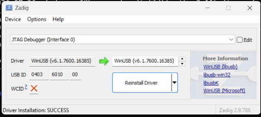
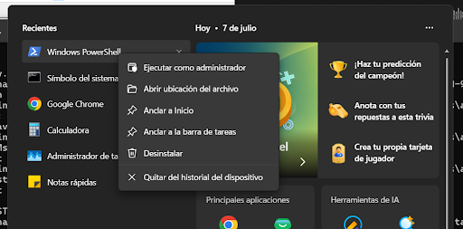
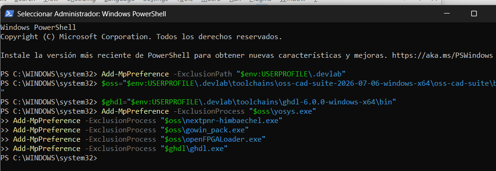
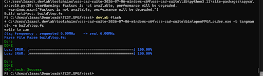
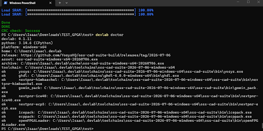

# Guía Rápida para Windows 

Esta guía proporciona pasos específicos para configurar DevLab en Windows y evitar problemas comunes.

## Instalación Rápida

### 1. Instalar Requisitos

```powershell
# Instalar 7-Zip (requerido para extraer toolchains)
winget install 7zip.7zip

# Verificar que Python 3.11+ esté instalado
python --version
```

::: tip Descarga Zadig
Descarga Zadig desde [https://zadig.akeo.ie/](https://zadig.akeo.ie/) antes de continuar.
:::

### 2. Configurar Driver USB con Zadig

**Antes de instalar DevLab**, necesitas configurar el driver USB para la FPGA usando Zadig.

1. Descarga Zadig desde [https://zadig.akeo.ie/](https://zadig.akeo.ie/)
2. Conecta tu tarjeta FPGA (Tang Nano 9K u otra) al puerto USB
3. Ejecuta Zadig
4. En el menú **Options**, activa **List All Devices**
5. Selecciona tu dispositivo FPGA de la lista desplegable
   - Para Tang Nano 9K: busca "JTAG Debugger" o "USB-JTAG"
6. Selecciona el driver **WinUSB** o **libusbK** en la lista de la derecha
7. Haz clic en **Replace Driver** o **Install Driver**
8. Espera a que la instalación termine


*Zadig mostrando la instalación exitosa del driver WinUSB para JTAG Debugger*

::: warning Importante
Sin el driver WinUSB/libusbK, openFPGALoader no podrá comunicarse con la FPGA. Este paso es **obligatorio** en Windows.
:::

### 3. Instalar DevLab

```powershell
# Actualizar pip
python -m pip install --upgrade pip

# Instalar la versión con soporte VHDL/GHDL para Windows
python -m pip install --upgrade git+https://github.com/UNIT-Electronics-Labs/unit_devlab_lib.git

# Instalar OSS CAD Suite y GHDL
python -m devlab install --force
python -m devlab install-ghdl

# Verificar instalación
python -m devlab --version
python -m devlab doctor
```

Mientras la versión nueva no esté publicada en PyPI, instala DevLab desde
GitHub como se muestra arriba. La versión esperada con el hotfix de Windows es:

```text
devlab 0.1.11
```

Si el comando `devlab` está disponible en `PATH`, puedes omitir `python -m` en
todos los ejemplos de esta página.

## Soporte VHDL/GHDL en Windows

OSS CAD Suite para Windows no incluye GHDL. Por eso DevLab lo instala como un
paquete independiente y lo utiliza únicamente para convertir las fuentes VHDL
a Verilog antes de ejecutar Yosys.

### Instalar GHDL

```powershell
python -m devlab install-ghdl
```

El comando instala `ghdl-mcode-6.0.0-ucrt64.zip` en una ruta equivalente a:

```text
C:\Users\<usuario>\.devlab\toolchains\ghdl-6.0.0-windows-x64
```

### Verificar el flujo sin compilar

Puedes crear un proyecto mínimo y revisar los comandos que ejecutaría DevLab:

```powershell
python -m devlab new blink-vhdl --hdl vhdl
cd blink-vhdl
python -m devlab build --dry-run
```

La salida debe comenzar con una etapa GHDL similar a:

```powershell
ghdl --synth --std=08 --out=verilog src/top.vhd -e top > build/top_ghdl.v
```

Después, Yosys debe recibir el Verilog generado:

```powershell
yosys -p "synth_gowin -top top -json build/top.json" build/top_ghdl.v
```

El flujo completo es:

```text
Fuentes VHDL
  -> ghdl --synth --out=verilog
  -> build/<top>_ghdl.v
  -> yosys
  -> nextpnr-himbaechel
  -> gowin_pack
```

No se usa `yosys-ghdl` en Windows. El paquete GHDL incluye `ghdl.exe` y sus
bibliotecas, pero no un plugin `ghdl_yosys.dll`.

### Verificar el paquete de OSS CAD Suite

DevLab verifica automáticamente el SHA-256 del archivo descargado. Para el
release `2026-07-06` también puedes comprobarlo manualmente:

```powershell
Get-FileHash "$env:USERPROFILE\.devlab\cache\oss-cad-suite-windows-x64-20260706.exe" -Algorithm SHA256
```

El valor esperado es:

```text
E8AB814D490D89163E418DC634842CF086EA305DDE0C32F832528194A5B93AC9
```

## Configuración de Windows Defender (Importante)

Los ejecutables de OSS CAD Suite y GHDL pueden ser inspeccionados o bloqueados
por Defender. Empieza con exclusiones por proceso y agrega la exclusión de
carpeta solamente si el problema continúa.

### Ejecutar PowerShell como Administrador

1. Presiona `Win + X`
2. Selecciona "Windows PowerShell (Administrador)" o "Ejecutar como administrador"


*Menú de Windows mostrando la opción "Ejecutar como administrador"*

3. Copia y pega los siguientes comandos:

```powershell
# Define las rutas de los toolchains
# NOTA: Actualiza las versiones según lo que DevLab instaló
$oss="$env:USERPROFILE\.devlab\toolchains\oss-cad-suite-2026-07-06-windows-x64\oss-cad-suite\bin"
$ghdl="$env:USERPROFILE\.devlab\toolchains\ghdl-6.0.0-windows-x64\bin"

# Agrega exclusiones de procesos
Add-MpPreference -ExclusionProcess "$oss\yosys.exe"
Add-MpPreference -ExclusionProcess "$oss\nextpnr-himbaechel.exe"
Add-MpPreference -ExclusionProcess "$oss\gowin_pack.exe"
Add-MpPreference -ExclusionProcess "$oss\openFPGALoader.exe"
Add-MpPreference -ExclusionProcess "$ghdl\ghdl.exe"

```


*Ejecución de los comandos de exclusión en PowerShell como Administrador*

### Verificar las Exclusiones

```powershell
Get-MpPreference | Select-Object -ExpandProperty ExclusionPath
Get-MpPreference | Select-Object -ExpandProperty ExclusionProcess
```

Si Defender continúa bloqueando DLL o archivos temporales, agrega una exclusión
limitada al directorio de herramientas:

```powershell
Add-MpPreference -ExclusionPath "$env:USERPROFILE\.devlab"
```

Evita desactivar la protección global de Windows.

## Uso Diario

### Compilar un Proyecto

```powershell
# Ir al directorio del proyecto
cd blink

# Compilar con Verilog
python -m devlab build

# Compilar con VHDL
python -m devlab build -c devlab-vhdl.toml

# Cargar en la FPGA
python -m devlab flash
```


*Resultado exitoso de `devlab flash` cargando el bitstream en la FPGA*

### Comandos Útiles

```powershell
# Ver información del sistema
python -m devlab doctor
```


*Comando `devlab doctor` mostrando las herramientas instaladas*

```powershell
# Limpiar archivos de compilación
Remove-Item -Recurse -Force build

# Ver ayuda
python -m devlab --help
```

## Solución de Problemas Comunes

### Error: "Command returned non-zero exit status 125"

**Síntoma**: El comando `devlab build` falla con un error de `nextpnr-himbaechel.exe`.

**Causa**: Windows Defender está bloqueando las herramientas.

**Solución**: 
1. Configura las exclusiones de Windows Defender (ver arriba)
2. Reinicia PowerShell
3. Intenta compilar nuevamente

### Windows App Control bloquea OSS CAD Suite

Si `devlab install` falla con `WinError 4551` e indica que una directiva de
Control de aplicaciones bloqueó el archivo, Windows impidió ejecutar el `.exe`
autoextraíble. Instala 7-Zip y fuerza la instalación:

```powershell
winget install 7zip.7zip
python -m devlab install --force
```

DevLab 0.1.11 o posterior utiliza `7z.exe` como primera opción cuando está
disponible, por lo que puede extraer el paquete sin ejecutar el autoextraíble.
Si no utilizas `winget`, instala 7-Zip desde
[7-zip.org](https://www.7-zip.org/) y comprueba que esté en `PATH` o en
`C:\Program Files\7-Zip`.

### Falta GHDL

```powershell
python -m devlab install-ghdl
python -m devlab doctor
```

### `nextpnr-himbaechel.exe` falla con `3221225785`

Este código suele indicar que se cargó una DLL incompatible. Actualiza DevLab y
comprueba la versión:

```powershell
python -m pip install --upgrade git+https://github.com/UNIT-Electronics-Labs/unit_devlab_lib.git
python -m devlab --version
```

Desde DevLab 0.1.9, las DLL de GHDL solamente se agregan al entorno del proceso
`ghdl`; `nextpnr-himbaechel.exe` se ejecuta con el entorno de OSS CAD Suite.

### Error de pines sin restricciones

Si el build llega a `nextpnr` y termina con `ERROR: Unconstrained IO`, el flujo
GHDL/Yosys ya funcionó. Actualiza `pins.cst` con los pines reales de tu tarjeta.

### Error: "7z is not recognized"

**Síntoma**: DevLab no puede extraer los toolchains.

**Causa**: 7-Zip no está instalado o no está en el PATH.

**Solución**:
```powershell
winget install 7zip.7zip
```

Reinicia PowerShell después de la instalación.

### Error: "Could not find JTAG device" al Cargar

**Síntoma**: `devlab flash` no encuentra la FPGA conectada.

**Causa**: Driver USB no configurado correctamente.

**Solución**:
1. Usa Zadig para instalar el driver WinUSB/libusbK (ver sección de instalación)
2. Desconecta y reconecta la FPGA
3. Verifica en el Administrador de Dispositivos que aparezca bajo "Universal Serial Bus devices"
4. Intenta `python -m devlab flash` nuevamente

### Error: "python: command not found"

**Síntoma**: Windows no encuentra Python.

**Causa**: Python no está instalado o no está en el PATH.

**Solución**:
1. Descarga Python desde [python.org](https://www.python.org/downloads/)
2. Durante la instalación, marca "Add Python to PATH"
3. Reinicia PowerShell

### La Compilación es Muy Lenta

**Causa**: Windows Defender está escaneando cada archivo.

**Solución**: Configura las exclusiones de Windows Defender (ver sección de configuración arriba).

### Error: "Access Denied" al Configurar Exclusiones

**Causa**: PowerShell no se ejecutó como Administrador.

**Solución**:
1. Cierra PowerShell
2. Presiona `Win + X`
3. Selecciona "Windows PowerShell (Administrador)"
4. Intenta nuevamente

## Actualizar Versiones de Toolchain

Las rutas en los scripts de exclusión incluyen números de versión. Cuando DevLab se actualice, verifica las rutas reales:

```powershell
# Ver el contenido del directorio de toolchains
ls $env:USERPROFILE\.devlab\toolchains
```

Actualiza las variables `$oss` y `$ghdl` con las nuevas versiones si es necesario.

## Recursos Adicionales

- [Guía General de DevLab](./devlab.md)
- [Archivos CST](./cst.md)
- [Introducción a Verilog](./verilog.md)
- [Introducción a VHDL](./vhdl.md)

## Nota de Seguridad

Las exclusiones de Windows Defender reducen la protección del sistema en las carpetas y procesos excluidos. Solo configura estas exclusiones si:

1. Confías en las herramientas de DevLab
2. Descargaste DevLab desde fuentes oficiales
3. Entiendes los riesgos de seguridad

Considera usar una máquina virtual o WSL2 si prefieres mantener Windows Defender completamente activo.
